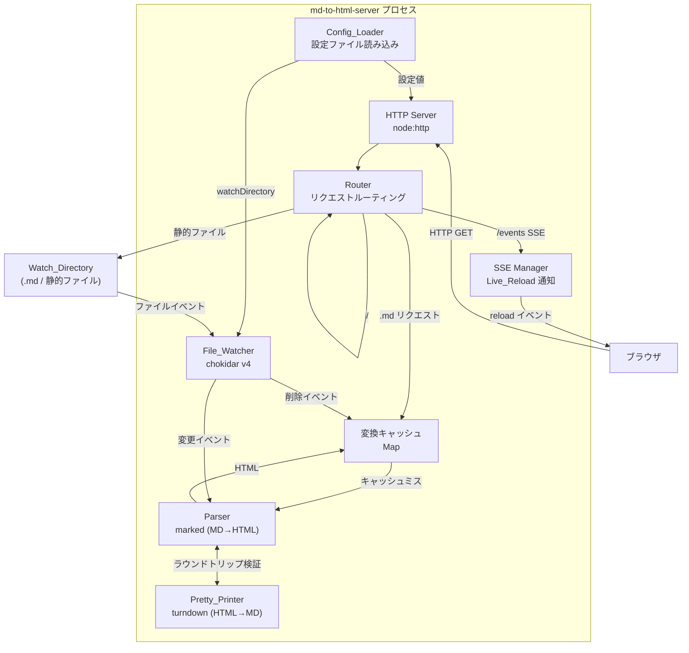

# Design Document: md-to-html-server

## Overview

md-to-html-server は、Watch_Directory 内の Markdown ファイルを自動的に HTML へ変換しブラウザで閲覧できるようにするローカル開発サーバーです。ユーザーはファイルを保存するだけで、追加の操作なしにブラウザからリアルタイムにプレビューできます。

**技術スタック:**

| 分類 | 採用技術 | 選定理由 |
|---|---|---|
| 言語 | TypeScript (Node.js 20+) | 型安全性とエディタ補完。Node.js 組み込みの `node:http` で外部依存を最小化 |
| MD→HTML | [marked](https://github.com/markedjs/marked) v12 | GFM 準拠、高速、ESM/CJS 両対応。最もメンテナンスが活発な Markdown パーサー |
| HTML→MD | [turndown](https://www.npmjs.com/package/turndown) v7 | JavaScript 製 HTML→Markdown 変換ライブラリ。GFM テーブル等のプラグインあり |
| ファイル監視 | [chokidar](https://github.com/paulmillr/chokidar) v4 | 2024年9月 v4 リリース。依存パッケージ数が 13→1 に削減、ESM/CJS 両対応 |
| 設定ファイル | [js-yaml](https://www.npmjs.com/package/js-yaml) | YAML パース用。JSON はネイティブで対応 |
| Content-Type | [mime-types](https://www.npmjs.com/package/mime-types) | 拡張子→MIME タイプのマッピング。未知の場合は `application/octet-stream` |
| テスト | [Vitest](https://vitest.dev/) + [fast-check](https://fast-check.dev/) | Vitest は ESM・TypeScript をネイティブサポート。fast-check は JavaScript/TypeScript 向け PBT ライブラリ |

---

## Architecture

### コンポーネント図



### データフロー

#### ブラウザからのリクエスト（Markdown ファイル）

```
Browser GET /path/to/file.md
  → Router → Cache.get(filePath)
    → キャッシュヒット: HTML をレスポンス（200, text/html; charset=utf-8）
    → キャッシュミス: Parser.parse(file content)
        → HTML を Cache に保存
        → HTML をレスポンス（200）
```

#### ファイル変更時のライブリロード

```
ファイル保存
  → chokidar change/add イベント (デバウンス 300ms)
  → Parser.parse(new content) → Cache 更新
  → SSEManager.broadcast("reload")
  → 各ブラウザクライアントが window.location.reload()
```

---

## Components and Interfaces

### Config_Loader

設定ファイル（`mdserver.config.json` または `mdserver.config.yaml`）を読み込み、サーバー起動設定を構築します。

```typescript
interface ServerConfig {
  watchDirectory: string;  // 絶対パス（解決済み）
  port: number;            // 1-65535
  configFilePath?: string; // 使用した設定ファイルのパス
}

interface RawConfig {
  watchDirectory?: string;
  port?: number;
}

// 設定ロード（pure function - テスト可能）
function parseConfig(raw: unknown, cwd: string): Result<ServerConfig, ConfigError>;
function loadConfigFile(cwd: string): Promise<RawConfig | null>;
function generateStartupMessage(config: ServerConfig): string;
```

**設定ファイル探索順序:** `mdserver.config.json` → `mdserver.config.yaml`

### Parser

Markdown テキストを HTML へ変換する純粋関数コンポーネントです。

```typescript
type ParseResult =
  | { ok: true; html: string }
  | { ok: false; error: ParseError };

interface ParseError {
  kind: "null_input" | "binary_input" | "conversion_error";
  message: string;
}

// marked + gfm オプションで変換
function parseMarkdown(input: unknown): ParseResult;

// HTML に共通のスタイルシートとライブリロードスクリプトを埋め込む
function wrapHtml(bodyHtml: string, title: string): string;
```

### Pretty_Printer

HTML を GFM 準拠の Markdown へ変換します。ラウンドトリップ検証に使用されます。

```typescript
type PrintResult =
  | { ok: true; markdown: string }
  | { ok: false; error: string };

// turndown + GFM プラグイン
function prettyPrint(html: string): PrintResult;
```

### Router

HTTP リクエストを種別に応じて振り分けます。

```typescript
type RouteKind =
  | { kind: "markdown"; filePath: string }
  | { kind: "static"; filePath: string }
  | { kind: "index" }
  | { kind: "sse" }
  | { kind: "not_found"; requestPath: string };

// pure function - テスト可能
function resolveRoute(requestUrl: string, watchDirectory: string): RouteKind;

// レスポンス生成（pure function）
function generateIndexPage(files: string[], watchDirectory: string): string;
function generateErrorPage(statusCode: number, message: string): string;
```

### File_Watcher

chokidar v4 を使ってファイルシステムを監視し、変換処理を起動します。

```typescript
interface WatcherCallbacks {
  onChange: (filePath: string) => Promise<void>;
  onAdd:    (filePath: string) => Promise<void>;
  onUnlink: (filePath: string) => void;
}

// デバウンス付きイベントハンドラ（pure function - テスト可能）
function createDebouncedHandler<T>(
  fn: (arg: T) => void,
  delayMs: number
): (arg: T) => void;

function startWatcher(directory: string, callbacks: WatcherCallbacks): FSWatcher;
```

### SSE Manager

SSE（Server-Sent Events）でブラウザへのライブリロード通知を管理します。

```typescript
interface SseClient {
  id: string;
  response: ServerResponse;
}

class SseManager {
  addClient(client: SseClient): void;
  removeClient(clientId: string): void;
  broadcast(event: string): void;          // 全クライアントへ送信
  startHeartbeat(intervalMs: number): void; // 60秒 ±5秒
  getClientCount(): number;
}
```

---

## Data Models

### キャッシュ

```typescript
// ファイルパス（絶対パス）→ 変換済み HTML の Map
type HtmlCache = Map<string, string>;
```

### 設定

```typescript
// デフォルト値
const CONFIG_DEFAULTS = {
  port: 3000,
  watchDirectory: process.cwd(),
} as const;

// バリデーションルール
const PORT_MIN = 1;
const PORT_MAX = 65535;
const DEBOUNCE_MS = 300;
const HEARTBEAT_INTERVAL_MS = 60_000;
const HEARTBEAT_TOLERANCE_MS = 5_000;
```

### ファイル一覧

```typescript
// Watch_Directory のサブディレクトリを含む .md ファイルパス一覧
// ルート相対パス（例: "docs/intro.md"）
type MarkdownFileList = string[];
```

---

## ディレクトリ構成

```
md-to-html-server/
├── src/
│   ├── index.ts          # エントリポイント（起動処理）
│   ├── server.ts         # HTTP サーバー起動・リクエスト処理
│   ├── config.ts         # Config_Loader（設定ファイル読み込み）
│   ├── parser.ts         # Parser（MD→HTML）
│   ├── pretty-printer.ts # Pretty_Printer（HTML→MD）
│   ├── router.ts         # Router（リクエストルーティング）
│   ├── watcher.ts        # File_Watcher（chokidar ラッパー）
│   ├── sse.ts            # SSE Manager（ライブリロード）
│   └── types.ts          # 共通型定義
├── tests/
│   ├── unit/
│   │   ├── parser.test.ts
│   │   ├── pretty-printer.test.ts
│   │   ├── router.test.ts
│   │   ├── config.test.ts
│   │   └── sse.test.ts
│   ├── property/
│   │   ├── parser.property.test.ts       # PBT: ラウンドトリップ、GFM変換
│   │   ├── router.property.test.ts       # PBT: ルーティング
│   │   ├── config.property.test.ts       # PBT: 設定バリデーション
│   │   ├── sse.property.test.ts          # PBT: クライアント管理
│   │   └── content-type.property.test.ts # PBT: Content-Type判定
│   └── integration/
│       ├── file-watcher.test.ts
│       └── server.test.ts
├── package.json
├── tsconfig.json
├── vitest.config.ts
└── mdserver.config.json  # 設定ファイルの例
```

---

## Correctness Properties

*A property is a characteristic or behavior that should hold true across all valid executions of a system — essentially, a formal statement about what the system should do. Properties serve as the bridge between human-readable specifications and machine-verifiable correctness guarantees.*

### Property 1: Markdown レスポンスの HTTP 属性

*For any* 有効な Markdown 文字列に対して、HTTP リクエストハンドラは HTTP 200 ステータスと `Content-Type: text/html; charset=utf-8` ヘッダーを持つレスポンスを返す。

**Validates: Requirements 1.1**

---

### Property 2: 存在しないリソースは常に 404

*For any* Watch_Directory に存在しないファイルパスに対するリクエストは、ファイルの種類（.md またはその他）にかかわらず HTTP 404 ステータスとエラーメッセージを含む HTML を返す。

**Validates: Requirements 1.2, 6.3**

---

### Property 3: インデックスページに全ファイルリンクが含まれる

*For any* Markdown ファイル名のリストに対して、`generateIndexPage` 関数はリスト内のすべてのファイル名へのリンクを含む HTML を返す。

**Validates: Requirements 1.3**

---

### Property 4: GFM 構文の HTML 変換

*For any* GFM 要素（見出し・リスト・コードブロック・テーブル・打消し線等）を含む Markdown 文字列に対して、`parseMarkdown` は対応する HTML タグを含む文字列を返す。

**Validates: Requirements 2.1**

---

### Property 5: ラウンドトリップ安定性（Markdown → HTML → Markdown → HTML）

*For any* 有効な Markdown 文字列 `md` に対して、`parseMarkdown(prettyPrint(parseMarkdown(md)).markdown)` の出力は `parseMarkdown(md)` の出力と構造的に同一の HTML を返す（2回目以降の変換は冪等である）。

**Validates: Requirements 2.4, 2.5**

---

### Property 6: デバウンス後は変換処理が 1 回だけ起動される

*For any* n 回（n ≥ 2）のファイル変更イベントが 300ms 以内に連続して発行された場合、デバウンス付きハンドラに渡されたコールバックは最後のイベントから 300ms 後に正確に 1 回だけ呼ばれる。

**Validates: Requirements 3.5**

---

### Property 7: エラー時のキャッシュ不変性

*For any* キャッシュ状態において、Markdown ファイルの変換処理中にエラーが発生したとき、キャッシュは変換前の状態と同一のままである（既存のエントリが変更・削除されない）。

**Validates: Requirements 3.6**

---

### Property 8: 切断クライアントへの通知スキップ

*For any* n 個のクライアント（n ≥ 1）の接続セットから 1 つのクライアントが切断された場合、`SseManager.broadcast` は残り n-1 個のクライアントにのみイベントを送信し、切断されたクライアントには送信しない。

**Validates: Requirements 4.5**

---

### Property 9: 設定のデフォルト値フォールバック

*For any* `watchDirectory` または `port` フィールドを省略した設定オブジェクトに対して、`parseConfig` は省略されたフィールドにデフォルト値（port: 3000、watchDirectory: cwd）を使用した `ServerConfig` を返す。

**Validates: Requirements 5.2, 5.5, 5.6**

---

### Property 10: 不正な設定値はエラーを返す

*For any* 有効範囲外のポート値（1 未満または 65535 超、または非整数）、および不正な JSON/YAML 文字列に対して、`parseConfig` は常にエラー結果を返す（正常な `ServerConfig` を返すことはない）。

**Validates: Requirements 5.7, 5.8, 5.9**

---

### Property 11: Content-Type の正確なマッピング

*For any* ファイル拡張子文字列に対して、`getContentType` は既知の拡張子（`.html`, `.css`, `.js`, `.png`, `.jpg` 等）については正しい MIME タイプを返し、未知の拡張子については `application/octet-stream` を返す。

**Validates: Requirements 6.2**

---

### Property 12: 静的ファイルのバイト列保全性

*For any* バイト列を内容とする静的ファイルに対して、HTTP レスポンスボディは元のバイト列と完全に一致する（変換・エンコード処理が一切行われない）。

**Validates: Requirements 6.1**

---

## Error Handling

### エラーカテゴリと対応方針

| カテゴリ | 発生場所 | 対応 |
|---|---|---|
| 変換エラー | Parser | HTTP 500 を返す。キャッシュは変更しない |
| ファイル未発見 | Router | HTTP 404 を返す |
| 設定ファイル書式エラー | Config_Loader | コンソールにエラーを出力してプロセスを終了 |
| 不正ポート値 | Config_Loader | コンソールにエラーを出力してプロセスを終了 |
| watchDirectory 不存在 | Config_Loader | コンソールにエラーを出力してプロセスを終了 |
| ポート競合 | HTTP Server | `EADDRINUSE` を捕捉し、エラーを出力してプロセスを終了 |
| SSE クライアント切断 | SSE Manager | クライアントリストから削除。他クライアントへの配信を継続 |
| null / バイナリ入力 | Parser | `ParseError` として明示的に返す（例外をスローしない） |

### エラー表現パターン

コンポーネント間はすべて例外ではなく Result 型でエラーを伝搬します。例外は外部ライブラリからの I/O 境界でのみ発生しうるため、エントリポイントでキャッチします。

```typescript
type Result<T, E> = { ok: true; value: T } | { ok: false; error: E };
```

---

## Testing Strategy

### デュアルテストアプローチ

本プロジェクトは **ユニットテスト（具体例）** と **プロパティベーステスト（普遍的性質）** を組み合わせた戦略を採用します。

#### プロパティベーステスト（fast-check）

PBT は以下の純粋関数コンポーネントに適用します。

| テストファイル | 対象 Property | fast-check アービトラリ |
|---|---|---|
| `parser.property.test.ts` | Property 4, 5 | `fc.string()`, `fc.array()` でGFM要素を生成 |
| `router.property.test.ts` | Property 1, 2, 3 | `fc.webPath()`, `fc.array(fc.string())` |
| `config.property.test.ts` | Property 9, 10 | `fc.record()`, `fc.integer()` で設定オブジェクトを生成 |
| `sse.property.test.ts` | Property 8 | `fc.array()` でクライアントセットを生成 |
| `content-type.property.test.ts` | Property 11, 12 | `fc.string()`, `fc.uint8Array()` |

**設定:**
- 各プロパティテストは最低 100 イテレーション実行
- タグ形式: `// Feature: md-to-html-server, Property N: <property_text>`

```typescript
// 例: Property 5（ラウンドトリップ安定性）
// Feature: md-to-html-server, Property 5: ラウンドトリップ安定性
it("round-trip stability", () => {
  fc.assert(
    fc.property(validMarkdownArbitrary(), (md) => {
      const html1 = parseMarkdown(md);
      if (!html1.ok) return;
      const printed = prettyPrint(html1.html);
      if (!printed.ok) return;
      const html2 = parseMarkdown(printed.markdown);
      if (!html2.ok) return;
      expect(normalizeHtml(html2.html)).toBe(normalizeHtml(html1.html));
    }),
    { numRuns: 100 }
  );
});
```

#### ユニットテスト（Vitest）

具体的な例・エッジケース・統合点の検証に使用します。

- **具体例**: GFM 各構文要素の変換結果確認
- **エッジケース**: 空ファイル、null 入力、空のファイルリスト
- **境界値**: ポート 1、65535、65536

#### 統合テスト

外部サービスや I/O を伴う動作の検証に使用します（各 1〜3 例）。

- **File_Watcher**: 実際にファイルを書き込み・削除してコールバックが呼ばれることを確認
- **時間制約**: ファイル変更から 1 秒以内に HTML_Output が書き出されること
- **ポート競合**: 同一ポートへの 2 度目のバインドがエラーで終了すること
- **SSE Live_Reload**: SSE クライアントがファイル変更後 1 秒以内に reload イベントを受信すること

#### vitest.config.ts の設定例

```typescript
import { defineConfig } from "vitest/config";

export default defineConfig({
  test: {
    include: ["tests/**/*.test.ts"],
    coverage: {
      provider: "v8",
      include: ["src/**/*.ts"],
      thresholds: { lines: 80, functions: 80 },
    },
  },
});
```
